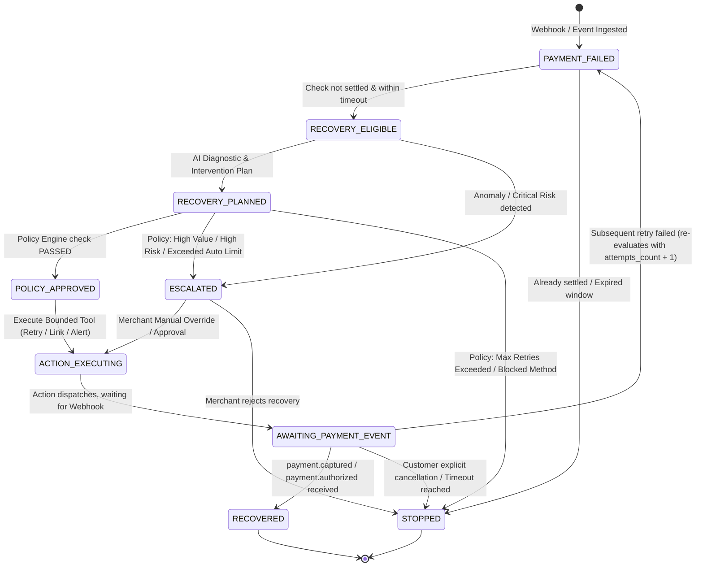

# Recovery State Machine & Stopping Rules

## 1. Primary Lifecycle State Diagram

## 2. Stopping Rules Matrix

| Trigger Condition | Target State | Execution Safety Action | Explainability Reason |
|---|---|---|---|
| Payment already settled / captured | `STOPPED` / `NO_ACTION` | Immediate abort | Transaction is already paid in full. Retrying would cause duplicate charge. |
| Attempts >= Max Retries (e.g. 2) | `STOPPED` | Halt all retries | Reached merchant safety limit for automated interventions. Prevents card issuer penalties. |
| Risk Score >= 0.75 | `ESCALATED` | Block auto-action, alert fraud ops | Suspected velocity abuse or stolen credential pattern. |
| Transaction Amount > Autonomous Limit | `ESCALATED` | Route to finance manager approval | Exceeds merchant auto-approval threshold of ₹5,000. |
| Duplicate Webhook Event ID | `IDEMPOTENT_IGNORED` | Drop execution, record duplicate | Event already processed. State machine remains unchanged. |
| Incompatible Failure (Invalid Card Number) | `STOPPED` | Do not retry | Hard decline / invalid credentials cannot be solved by retrying. |
